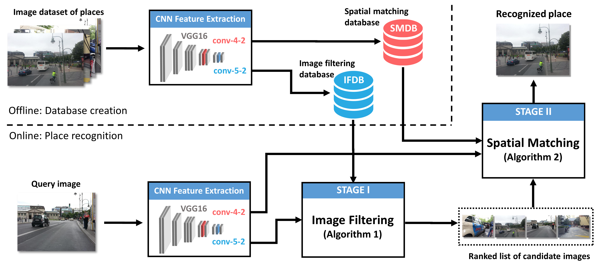

# Semantic and Spatial Matching Visual Place Recognition (SSM-VPR)
This is the official repository for the SSM-VPR methodology presented in the following papers:

*[Spatio-Semantic ConvNet-Based Visual Place Recognition (ECMR 2019)](https://arxiv.org/abs/1909.07671)*

*[Highly Robust Visual Place Recognition Through Spatial Matching of CNN Features (ICRA 2020)](https://www.researchgate.net/publication/335715895_Highly_Robust_Visual_Place_Recognition_Through_Spatial_Matching_of_CNN_Features)*

*[Visual Place Recognition by Spatial Matching of High-level CNN Features (RAS 2020)](https://www.researchgate.net/publication/338841595_Visual_Place_Recognition_by_Spatial_Matching_of_High-level_CNN_Features)*

We propose a robust visual place recognition (VPR) pipeline based on a standard image retrieval configuration, with an initial stage that retrieves the closest candidates to a query from a database and a second stage where the list of candidates is re-ranked. The latter is realized by the introduction of a novel geometric verification procedure that uses the activations of a pre-trained convolutional neural network. As a stand-alone, general spatial matching methodology, it could be easily added and used to enhance existing  VPR approaches whose output is a ranked list of candidates. The system achieves state-of-the-art place recognition precision on a number of standard benchmark datasets when compared with approaches commonly appearing the literature. Please see the above papers for details, in paticular the third, most recent one. You can also watch this [seminar](http://impact.ciirc.cvut.cz/wp-content/uploads/2020/04/2020-04-09-1100-AAG-IMPACT-MASO.mp4),  where we describe the system and our main results in some detail. 


This system is summarized in the following diagram:
<p align="center">
  
  <br /><em>System's flowchart</em>
</p>

## Graphical user interface
The system, implemented as in the paper referenced in the citation section,  can be tested by using a (currently under development) GUI that allows loading of reference and query sequences of images as well as a file containing the ground truth correspondances of the query sequence. The figure below shows an screenshot of the interface.
<p align="center">
  
  <br /><em>Screenshot of the graphical user interface</em>
</p>

The functionality of the different panels in the GUI are as follows:
- STAGE I: Sets the image size employed during the *image database filtering stage* of the pipline (default is optimum for the datasets used in our paper, see citation section). The filtering method can also be selected. Currently there are only two options: (1) our original implementation based on layer *conv_5_2* of the VGG16 architecture and (2) the [NetVLAD](https://arxiv.org/abs/1511.07247) architecture, whose python implementation can be found [here](https://github.com/uzh-rpg/netvlad_tf_open).   
- STAGE II: Allows selecting the image size during the *spatial matching stage* of the pipeline. Parameters such as the number of candidates considered from stage I or the frame tolerance can also be set. Information about each parameter is provided by placing the mouse cursor over them.
- Select Files: Used to load directories for reference and test (aka query or live) sequences. Also for loading the ground truth csv file  
- Run: Used to either create database of descriptors from the reference sequence or to start recognition using the test sequence. 
- Controls: Allows to pause, resume or stop recognition
- Visualization: It shows query, recognized and assigned reference ground truth images
- Console: Presents recognition output and metrics such as precision, recall, recognition score or average latency. Each displayed record can be clicked, causing the corresponding images being updated in the visuallization panel. It is therefore possible to navigate through all past recognitions and to visually check the output.

## Installation
The code has been tested on Ubuntu 18.04 Bionic and Python 3.6.6.
For installation, just clone or download the project into your computer. Installation of the following libraries and possibly others may be necessary:    
  __csv, cv2, keras, matplotlib, numpy, PyQt5, random, sklearn, tensorflow, tkinter, time__ 

To start the GUI, cd from the command line into the project's main directory and type 
```bash
python3 ssmapp.py
```
## Datasets
If you want to reproduce the main results of our paper "Visual Place Recognition by Spatial Matching of High-level CNN Features", the employed image datasets can be downloaded from [here](http://imr.ciirc.cvut.cz/Datasets/Ssm-vpr).  


## Running the code
### Creating descriptors databases
Once the GUI is loaded, first thing is to create a database from the reference sequence of the dataset of choice. 
1. Go to __Select file -> Reference dir__ and find and select the corresponding sequence directory. 
2. Then press __Run -> Create db__ to start creating the database. Progress will be displayed on the console panel.
A different database is created for each reference sequence and set of parameters in the GUI. They are stored on disk (in /db) and therefore only need to be created once. They are automatically detected next time their used is required.
### Running place recognition 
After descriptors have been created and stored to disk, a query sequence can be tested by going to 
1. __Select files -> Test dir__ and find and select the test sequence directory
2. __Select files -> Ground truth__ and find and select the GroundTruth.csv file for the current dataset
3. Presssing the __Run -> Recognition__ button
### Controls
During recognition, the __Control__ buttons can be pressed at any time to pause, resume or finalize recognition. 

## File format
It is expected that the datasets to be tested consist of query and reference image sequences, both belonging to the same route but most likely recorded at different times and under changing conditions and viewpoints. File names in the sequences are expected in the format imageXXXX.png or imageXXXX.jpg, where XXXXX is a unique identifier number that increases as the sequences progress in time (e.g. image0001.png, image0002.png, etc.). The ground truth file (GroundTruth.csv) is a spreadsheet containing "Reference" and "Live" columns, where rows associates each live query identifier to its reference ground truth. During recognition, each query image is compared with all reference images and the most similar selected as the  location of the query. The ground truth file is then used to evaluate whether the guessed file is a true positive or not. A frame tolerance can be set in the interface to make the evaluation more or less strict.

## Testing your own datasets
The format of any used dataset must meet the requirements explained in the __File format__ section. If you wish to test your own datasets, you must put your sequences into Reference and Live directories within your dataset directory and name the files as explained above. You must also create a __Groundtruth.csv__ file that associates Live images with Reference ground truth images, either by manually parsing and annotating image pairs or by using some other means such as GPS information.

## Citation

Please consider citing the corresponding publication if you use this work:
```
@article{camara2020spatialmatching,
  title={Visual Place Recognition by Spatial Matching of High-level CNN Features},
  author={Camara, Luis G.  and  P\v{r}eu\v{c}il, Libor},
  journal={Robotics and Autonomous Systems, accepted for publication},
  volume={},
  number={},
  pages={},
  year={2020},
  publisher={Elsevier}
}
```
