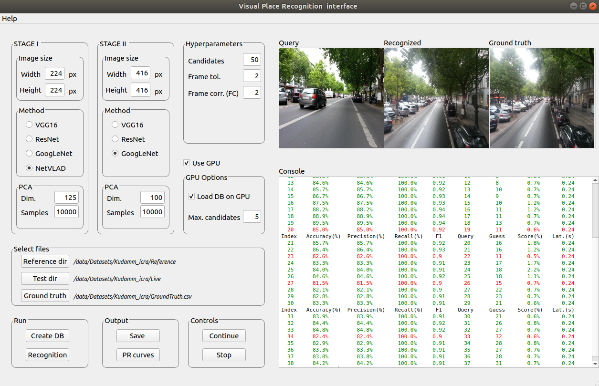

# Semantic and Spatial Matching Visual Place Recognition (SSM-VPR)
This is the official repository for the SSM-VPR methodology presented in the following papers:

*[Spatio-Semantic ConvNet-Based Visual Place Recognition](https://arxiv.org/abs/1909.07671)*

*[Highly Robust Visual Place Recognition Through Spatial Matching of CNN Features](https://www.researchgate.net/publication/335715895_Highly_Robust_Visual_Place_Recognition_Through_Spatial_Matching_of_CNN_Features)*

*[Visual Place Recognition by Spatial Matching of High-level CNN Features](https://www.researchgate.net/publication/338841595_Visual_Place_Recognition_by_Spatial_Matching_of_High-level_CNN_Features)*

We propose a robust visual place recognition (VPR) pipeline based on a standard image retrieval configuration, with an initial stage that retrieves the closest candidates to a query from a database and a second stage where the list of candidates is re-ranked. The latter is realized by the introduction of a novel geometric verification procedure that uses the activations of a pre-trained convolutional neural network. As a stand-alone, general spatial matching methodology, it could be easily added and used to enhance existing  VPR approaches whose output is a ranked list of candidates. The system achieves state-of-the-art place recognition precision on a number of standard benchmark datasets when compared with approaches commonly appearing the literature. Please see the above papers for details. 

This system is summarized in the following diagram:
<p align="center">
  
  <br /><em>System's flowchart</em>
</p>

## User interface
The system can be tested by using a very simplistic interface that allows loading of reference and query sequences of images as well as a file containing the ground truth correspondances between the two. The figure below shows an screenshot of the interface.
<p align="center">
  
  <br /><em>System's flowchart</em>
</p>

File names are expected in the format imageXXXXX.png or imageXXXXX.jpg  

## Citation

Please consider citing the corresponding publication if you use this work:
```
@article{camara2020spatialmatching,
  title={Visual Place Recognition by Spatial Matching of High-level CNN Features},
  author={Camara, Luis G.  and  P\v{r}eu\v{c}il, Libor},
  journal={Robotics and Autonomous Systems, accepted for publication},
  volume={},
  number={},
  pages={},
  year={2020},
  publisher={Elsevier}
}
```
